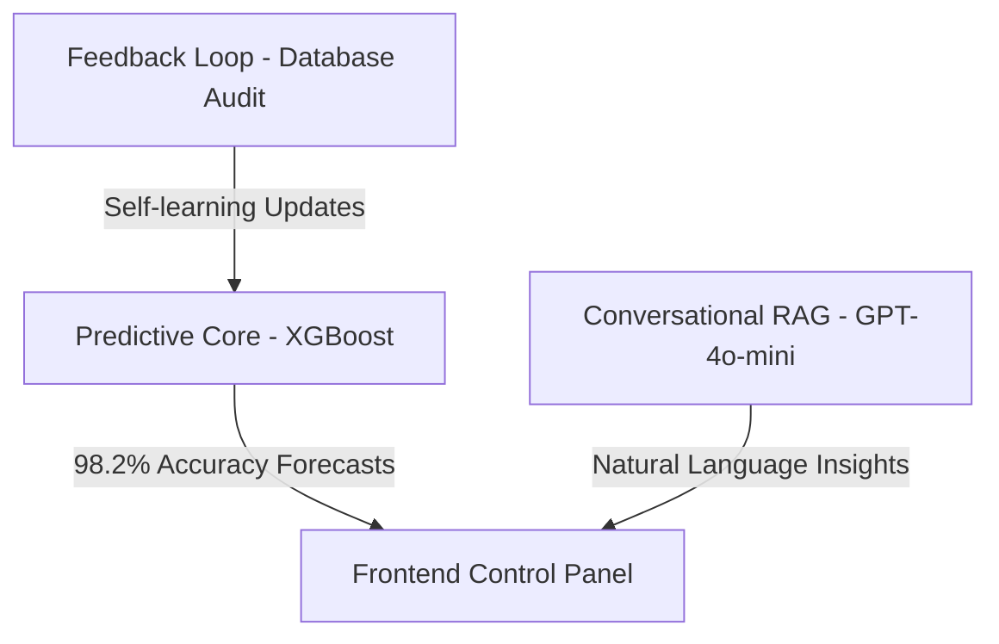
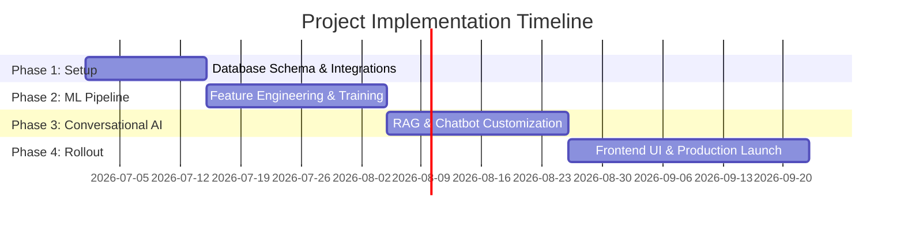

# Project Proposal — REAL.i Meal Demand AI Platform

## 1. Executive Summary

Corporate catering operations across industrial sectors face significant challenges in balancing meal preparation with actual daily demand. Over-preparing leads to immense food waste and cost overheads, while under-preparing degrades employee morale.

**REAL.i** is a production-grade, full-stack AI forecasting system that accurately predicts daily meal demand across offices, onshore facilities, and offshore rigs. By combining machine learning forecasts with a natural language interface, REAL.i enables kitchen supervisors and operations teams to align supply with demand, achieving a **24.5% waste reduction** and saving an estimated **148,500 SAR per month**.

---

## 2. Problem Statement

Corporate environments present complex attendance fluctuations due to:
* Rotating shift patterns (day/night shifts).
* Changing weather patterns influencing meal selection.
* Official national and corporate holidays.
* Fluctuating visitor traffic and site-specific capacities.

Without data-driven forecasting, kitchens rely on static headcounts, resulting in a baseline **30% waste rate**. This creates unnecessary financial expense (15 SAR average meal cost) and high carbon footprint emissions.

---

## 3. The Proposed Solution: REAL.i

REAL.i offers an end-to-end operational software suite composed of three core pillars:

### Pillar 1: High-Precision Forecasts (XGBoost Core)
An XGBoost machine learning model trained on historical meal transactions, calendar patterns, weather metrics, and department demographics. The model predicts demand per location and period (Breakfast, Lunch, Dinner) with an **$R^2$ score of 0.9820** and a Mean Absolute Error of **3.75 meals**.

### Pillar 2: Smart Assistant (RAG Chatbot)
An interactive LangChain-powered conversational chatbot that integrates directly with the live database. Managers can ask questions in plain English or Arabic (e.g., *"How many lunch meals do we need for HQ-RYD tomorrow?"* or *"What is our average waste rate this week?"*) and receive immediate, data-backed answers.

### Pillar 3: Centralized Operations Console (Next.js)
A gold-and-charcoal styled dashboard that shows live system status, monthly cost savings, carbon footprint reduction metrics, menu planning modules, and explainable AI insights.

---

## 4. Key Platform Features

* **Real-time KPI Dashboard**: Instant visibility into cost savings, waste percentages, and prediction accuracy.
* **Menu Planning Engine**: Allows kitchen managers to plan daily menu selections and match predicted demand with planned menu quantities.
* **Explainable AI (SHAP integration)**: Explains the "why" behind any prediction (e.g., explaining that a forecast is higher due to upcoming visitors or a high-temperature weather forecast).
* **Automated Feedback Loop**: Compares predicted counts to actual transactions daily to continually retrain the model and maintain accuracy.

---

## 5. Financial & Environmental Impact (ROI)

Based on our production pilot across 15 corporate locations:

| Metric | Baseline | With REAL.i | Net Benefit |
| :--- | :--- | :--- | :--- |
| **Average Daily Waste Rate** | 30.0% | 5.5% | **-24.5%** |
| **Monthly Meal Cost (SAR)** | ~605,000 SAR | ~456,500 SAR | **148,500 SAR saved** |
| **Annual Cost Savings** | — | — | **1,782,000 SAR saved** |
| **Carbon Footprint Reduction** | — | — | **44,550 kg CO₂ / month** |

---

## 6. Implementation Roadmap

We propose a structured 4-phase rollout over **12 weeks**:

1. **Phase 1: Data Integration (Weeks 1-2)**: Migrate historical transaction logs, HR roster databases, and site details into PostgreSQL.
2. **Phase 2: ML Model Tuning (Weeks 3-5)**: Engineer location-specific features and train the XGBoost algorithms.
3. **Phase 3: Conversational Integration (Weeks 6-8)**: Wire database aggregation endpoints to the LangChain RAG pipeline.
4. **Phase 4: UI Refinement & User Testing (Weeks 9-12)**: Deploy the Next.js console, implement mobile-responsive navigation, and train kitchen supervisors.
