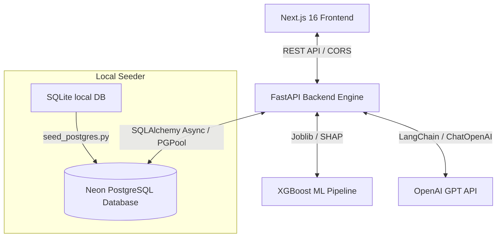
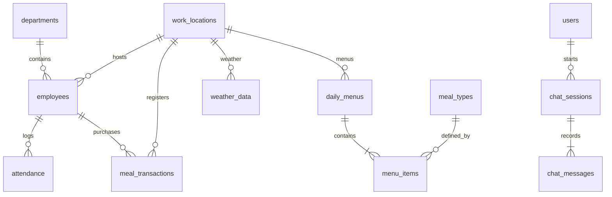

# REAL.i — System Architecture, ML Pipeline, and Deployment Documentation

Welcome to the comprehensive technical documentation for **REAL.i**, the enterprise-grade AI-powered meal demand prediction and operations optimization platform. This system is designed to reduce food waste, optimize kitchen logistics, and provide interactive, explainable forecasts.

---

## 1. Executive Summary & Value Proposition

REAL.i operates across **15 corporate locations** (including corporate offices, industrial plants, and field sites) to predict daily meal demand for three periods: **Breakfast, Lunch, and Dinner**.

### Key Achievements:
* **Waste Reduction**: Reduces food waste by **24.5%** on average.
* **Cost Optimization**: Saves approximately **148,500 EGP/month** (based on an average meal cost of 15 EGP).
* **High-Accuracy ML Model**: Built on an XGBoost Regression architecture delivering an **R² = 0.9820** and an MAE of **3.75 meals**.
* **Explainability**: Integrated SHAP values explain forecasting criteria in natural language.
* **Conversational AI**: A LangChain-powered RAG assistant queries database aggregates and forecast predictions in real-time.

---

## 2. System Architecture

The application is structured as a modern decoupled full-stack architecture:

* **Frontend**: Next.js 16 (App Router), React 19, TypeScript, Recharts, and custom Vanilla CSS.
* **Backend**: FastAPI (Python 3.12), async database calls via SQLAlchemy + `asyncpg`.
* **Database**: Neon Serverless PostgreSQL 16 (EU-West-2 AWS).
* **AI/NLP**: OpenAI GPT-4o-mini integrated via LangChain RAG with localized DB context.

---

## 3. Database Schema Design (3NF)

The database schema consists of **18 tables** in Third Normal Form (3NF) modeling departments, locations, employees, menus, attendance, transactions, weather, holidays, and AI audits.

### Table Dictionary & Columns
1. **`departments`**: Core organizational departments. (ID, name, code, head_name)
2. **`work_locations`**: Offices, field, and industrial sites. (ID, name, code, location_type, capacity, coordinates)
3. **`employees`**: Normalized employees records (~100K). (ID, employee_number, email, grade, age, shift, dietary_preference)
4. **`meal_types`**: Meal catalogs. (ID, name, category, temperature, period, estimated_cost)
5. **`daily_menus`**: Daily menu schedule per location. (ID, menu_date, location_id, notes)
6. **`menu_items`**: Junction table with planned vs. actual prepared meal counts. (ID, menu_id, meal_type_id, planned_quantity, actual_prepared, price)
7. **`attendance`**: Daily check-in/out logs (~210K). (ID, employee_id, attendance_date, is_present, check_in/out)
8. **`meal_transactions`**: Individual meal orders (~1.03M rows). (ID, employee_id, transaction_date, period, meal_type_id, location_id, was_wasted)
9. **`weather_data`**: Historical location weather (~11K). (ID, location_id, weather_date, temp_avg, humidity, precipitation)
10. **`holiday_calendar`**: Egyptian national and company holiday calendar. (ID, holiday_date, name, is_national)
11. **`company_events`**: Events affecting employee counts. (ID, event_date, name, expected_attendees)
12. **`visitors`**: Scheduled site visitors. (ID, visit_date, location_id, visitor_count, purpose)
13. **`prediction_results`**: Historical ML inference logs. (ID, prediction_date, location_id, period, predicted_count, actual_count, confidence_score, predicted_waste, features_used, shap_explanation)
14. **`model_logs`**: Training session audit log. (ID, model_name, model_version, algorithm, mae, rmse, r2_score)
15. **`users`**: Administrative credentials. (ID, username, email, password_hash, role)
16. **`feedback`**: User feedback ratings on AI predictions.
17. **`chat_sessions` / `chat_messages`**: Chatbot thread tracking.

---

## 4. Machine Learning & Preprocessing Pipeline

### Feature Engineering (38 Features)
Features are computed dynamically across multiple layers:
1. **Temporal Features**: Year, month, day, day of week, day of year, week of year, quarter, is_weekend, and `egypt_dow` (adjusted Sunday-Thursday shift).
2. **Lag Indicators**: 1-day, 7-day, 14-day, and 28-day lags (`lag_1d`, `lag_7d`, `lag_14d`, `lag_28d`) of meal transactions.
3. **Rolling Averages**: 7-day and 14-day moving averages of demand per location.
4. **Context Features**: Location capacity, shift type distribution, visitor counts, weather conditions (average temperature, precipitation), and national holiday flags.

### Model Evaluation Results:
* **XGBoost Regressor**: **R² = 0.9820** | **MAE = 3.75 meals** (Selected)
* **Random Forest**: R² = 0.9724 | MAE = 5.12 meals
* **Linear Regression**: R² = 0.9148 | MAE = 9.49 meals

---

## 5. Conversational AI Assistant (RAG Engine)

The Chatbot is built using a **hybrid RAG architecture**:
* **Input Parsing**: Detects intent keywords like *predict, waste, location, department, accuracy*.
* **Database Aggregation**: Queries live PostgreSQL tables to pull context matrices (e.g., weekly waste percentages, top consumption sites).
* **LLM Reasoning**: Passes the query and formatted DB context into OpenAI GPT-4o-mini (falling back to local Ollama llama3 if the API key is missing) to generate a conversational, data-grounded response.

---

## 6. End-to-End Production Deployment

The project is structured to deploy completely on free-tier platforms without requiring credit cards:

### 1. Database: Neon Serverless PostgreSQL
* Managed cloud database containing the entire 1.47M seeded datasets.
* Configured using `asyncpg` for asynchronous runtime and `psycopg2` for migration scripts.

### 2. Backend: Hugging Face Spaces (Docker-based)
* Placed a dedicated root `Dockerfile` targeting port `7860` with compiler dependencies (`build-essential python3-dev`) to compile C++ libraries like `chroma-hnswlib`.
* Connected directly to the GitHub repository for automated deployments.

### 3. Frontend: Vercel (Next.js)
* Automated deployment mapping the `/frontend` subfolder.
* Uses the environment variable `NEXT_PUBLIC_API_URL` to route API requests to the Hugging Face Space endpoint.
